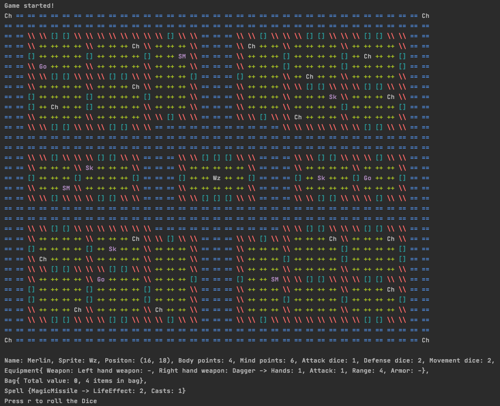

# Hero Quest OOP

Hero quest game, implementation with Java and OOP.
See the documentation [here](https://luccabavia.github.io/hero-quest-oop/docs)!

## Instalation

Only the default Java packages are needed. Just clone this repository and import into your favorite IDE.

## Usage

Run the _Runner.java_ and interactively play the game.
Below you can see the start screen of the game with the fog removed!

### Game rules

* When the game starts, the player chooses the hero type: Elf, Dwarf, Wizard or Barbarian. The player also chooses the map type: default or random (positions of monsters, chests and traps are random; moster types are also random)
* Currently, the game is controlled via a command line interface
* The game is played in rounds:
  * The hero round is divided into a movement phase, an action phase and a potion usage phase.
    * In the movement phase the hero walks around the map and discovers the map, which starts covered in fog. While walking the hero may step on a trap and get damaged.
    * In the action phase the hero can collect items in chests, attack mosters or use spells. While interacting with a chest, a monster may jump out of it!
  * The monsters round is also divided into a movement phase and an action phase.
    * In the movement phase, each monster executes their specific movement routine.
    * In the action phase each monster checks the distance to the hero and tries to attack.
  * During attacks, the characters can only interact with other characters that are in the same column or row. Two characters that have a wall, door, chest or other character between them cannot interact.

[here](https://luccabavia.github.io/hero-quest-oop/docs)
